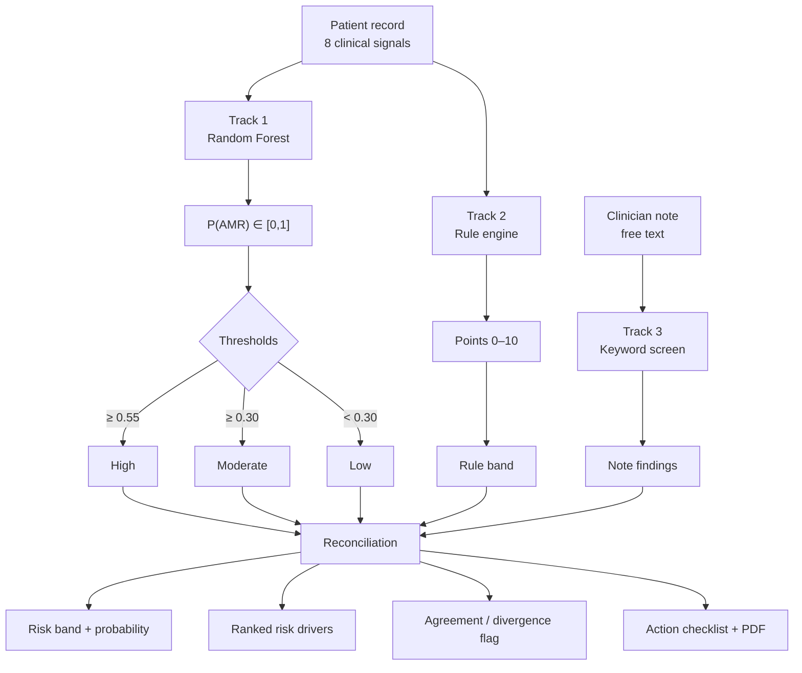

# ResistAI Sentinel

[](https://github.com/USERNAME/resistai-sentinel/actions/workflows/ci.yml)
[](https://github.com/USERNAME/resistai-sentinel/actions/workflows/secret-scan.yml)
[](https://www.python.org/downloads/)
[](LICENSE)

**An explainable clinical decision-support dashboard for antimicrobial resistance risk
and antibiotic stewardship.**

**Live demo:** _add the Streamlit Cloud URL here after the first deploy_

> ⚠️ Built on a **synthetic cohort**. This is a decision-support prototype and an
> engineering portfolio project — not a medical device, and not clinically validated.

---

## Table of contents

- [Why this exists](#why-this-exists)
- [What the system does](#what-the-system-does)
- [How it decides](#how-it-decides) ← the core of the project
- [Worked example](#worked-example)
- [The dashboard](#the-dashboard)
- [The data](#the-data)
- [Model card](#model-card)
- [Quick start](#quick-start)
- [Project structure](#project-structure)
- [Architecture](#architecture)
- [What changed from the notebook](#what-changed-from-the-notebook)
- [Security](#security)
- [Deployment](#deployment)
- [Limitations and roadmap](#limitations-and-roadmap)
- [License](#license)

---

## Why this exists

Antimicrobial resistance is one of the largest measurable health burdens we have.
The WHO estimates bacterial AMR was **associated with more than 4.7 million deaths
globally in 2021**, and the Lancet GRAM analysis forecasts **over 39 million deaths
directly attributable to it between 2025 and 2050**.

The mechanism driving it is not exotic. It is ordinary prescribing. In 2022 only
**53% of global human antibiotic use was first-line treatment**, against a WHO
target of 70% by 2030 — the remainder being broader or last-line agents used where
something narrower would have worked.

That gap is where a stewardship tool belongs. The clinically useful question is not
"does this patient have a resistant organism" — culture answers that in 48–72 hours,
and by then the empiric regimen is already running. It is:

> **Which patients, right now, are accumulating the exposure pattern that precedes
> resistance — and which ward is accumulating them fastest?**

ResistAI Sentinel answers that question from data a hospital already has on day one:
what was prescribed, how often it was switched, where the patient is, and what the
clinician wrote in the notes.

---

## What the system does

| | |
|---|---|
| **Input** | Per-patient antibiotic exposure, admission context, inflammatory markers, and the free-text clinician note |
| **Output** | A calibrated AMR risk probability, a risk band, the specific signals that drove it, and a matching infection-control checklist |
| **Scope** | Patient-level triage **and** ward-level hotspot surveillance |
| **Stack** | Python · scikit-learn · Streamlit · Plotly · ReportLab |

Three things distinguish it from a bare classifier:

1. **Every prediction is explained** — globally, and for the individual patient.
2. **A transparent rule engine runs in parallel** with the model, and disagreement
   between them is surfaced rather than hidden.
3. **The output is an action**, not a number: a checklist, a room hotspot list, and a
   one-page PDF for the stewardship round.

---

## How it decides

The decision is not a single model call. Three independent tracks run on every
patient and are reconciled in the UI.



### Track 1 — the machine learning model

A `RandomForestClassifier` (300 trees, depth 8, `min_samples_leaf=20`,
`class_weight="balanced"`) trained on **eight clinical signals**:

| Feature | Why it carries signal |
|---|---|
| `broad_spectrum_used` | Broad-spectrum exposure selects for resistant flora |
| `reserved_abx_used` | Last-line agents are only reached for when first-line failed |
| `antibiotic_switches` | Repeated switching is a proxy for treatment failure |
| `icu_admission` | Highest device density, highest selective pressure |
| `fever` | Active infection marker |
| `wbc_high` | Active infection marker |
| `prior_hospitalization` | Prior exposure to the hospital's resistant flora |
| `length_of_stay_days` | Cumulative exposure time |

The model outputs a **probability**, not a class. That is deliberate — a triage tool
that says "High" has thrown away the difference between 56% and 94%, and the
clinician needs that difference.

**What is deliberately *not* a feature:** `amr_risk_prob`, the latent probability the
simulator uses to generate the outcome. Including it is the [target leak](#1-target-leakage--the-big-one)
that made the original notebook look near-perfect.

### Thresholds

The probability becomes a band through two cut-offs in
[`config.py`](src/resistai/config.py):

```python
RISK_THRESHOLDS = RiskThresholds(high=0.55, moderate=0.30)
```

These are **operational choices, not statistical ones**, and they are one edit away
from being retuned. The reasoning behind the current values:

- **0.30 for Moderate** sits below the cohort's base rate of 38.8%. A stewardship
  tool that only flags above-average patients adds nothing — the point is to catch
  accumulating risk *before* it is obvious.
- **0.55 for High** is set where the recommended action becomes costly (isolation,
  an infection-control call-out). Too low and the team stops trusting the alerts;
  too high and the tool fires after the decision has already been made.

In a real deployment these would be set from the hospital's own antibiogram and
isolation capacity, not inherited from this repo.

### Track 2 — the rule engine

A six-line points table, scored independently of the model
([`scoring/rules.py`](src/resistai/scoring/rules.py)):

| Signal | Points |
|---|---:|
| Reserved (last-line) antibiotic exposure | 3 |
| Broad-spectrum antibiotic therapy | 2 |
| ICU admission | 2 |
| Prior hospitalization within 90 days | 1 |
| ≥ 1 antibiotic switch | 1 |
| Fever **and** elevated WBC | 1 |
| **Maximum** | **10** |

Bands: **High ≥ 6**, **Moderate ≥ 3**, **Low < 3**.

**Why keep a rule engine at all when a model exists?** Because a clinician can audit
a points table in ten seconds and cannot audit 300 decision trees in any amount of
time. The rule engine is what makes the tool arguable in a stewardship meeting.

### Track 3 — the clinician note

A curated keyword screen over the free-text note
([`scoring/notes.py`](src/resistai/scoring/notes.py)) — `"no improvement"`,
`"empiric therapy failed"`, `"suspected antimicrobial resistance"`, `"culture"`,
`"escalation"` — each mapped to a plain-language finding.

A transformer would score better here and explain worse. The note is a **supporting
signal**, not the decision, so auditability wins over accuracy.

### Reconciliation — what the clinician actually sees

The three tracks are not averaged into one number. Collapsing them would destroy the
most useful output the system produces: **their disagreement.**

| Model | Rules | What the UI shows |
|---|---|---|
| High | High | "Rule engine and model agree" — act on it |
| High | Low | ⚠️ "Rule engine says Low, model says High. Review manually." |
| Low | High | ⚠️ Same flag, inverted |

Divergence means the model is reacting to an interaction the points table does not
encode — which is either a genuine finding or a model artefact. Either way it is
exactly the patient a human should look at. A blended score would have hidden it.

### Local explanation — ablation

For the selected patient, the Explainability tab re-scores them once per active
signal with that signal zeroed, and reports the change in predicted probability.

```
Δ = P(AMR | patient) − P(AMR | patient with feature = 0)
```

This is an **ablation estimate, not SHAP**, and the UI says so. It is one model call
per active feature — cheap enough to run live, honest enough to show a clinician.
Swapping in Shapley values is a single-file change.

### From decision to action

A probability nobody acts on is a number in a dashboard. Each band maps to a fixed
checklist ([`ui/views/actions.py`](src/resistai/ui/views/actions.py)):

| Band | Actions |
|---|---|
| **High** | Contact isolation · culture & sensitivity · notify infection control · stewardship review within 24h · room disinfection |
| **Moderate** | Close monitoring · review regimen against local antibiogram · repeat inflammatory markers within 24h |
| **Low** | Standard precautions · continue current plan |

Plus a one-page PDF carrying the probability, the ranked drivers, the note findings
and the recommendation — generated **in memory**, never written to disk.

---

## Worked example

A real patient from the generated cohort, traced end to end.

**Patient `MRN-78D937B7` — ICU, room ICU-2**

| Signal | Value |
|---|---|
| Broad-spectrum antibiotic | Yes |
| Reserved antibiotic | Yes |
| Antibiotic switches | 3 |
| ICU admission | Yes |
| Fever | Yes |
| Elevated WBC | Yes |
| Prior hospitalization | No |
| Length of stay | 13 days |

**Track 1 — model:** `P(AMR) = 0.889` → **High** (0.889 ≥ 0.55)

**Track 2 — rules:** 9 / 10 → **High**

```
Reserved antibiotic exposure       +3
Broad-spectrum therapy             +2
ICU admission                      +2
Multiple antibiotic switches       +1
Fever with elevated WBC            +1
                                   ──
                                    9
```

**Track 3 — note:** _"Patient under evaluation. Vitals monitored. Empiric antibiotics
started. Recommend culture and antibiotic review."_
→ `Culture requested or pending`, `Antibiotic review recommended`

**Reconciliation:** both tracks say High. No divergence flag. The note independently
corroborates.

**Why the model said 0.889 — ablation:**

| Remove this signal | Probability drops to | Contribution |
|---|---:|---:|
| Broad-spectrum antibiotic | 0.767 | **+0.122** |
| Antibiotic switches | 0.803 | **+0.085** |
| ICU admission | 0.847 | +0.042 |
| Reserved antibiotic | 0.849 | +0.039 |
| Length of stay | 0.853 | +0.036 |
| Fever | 0.870 | +0.018 |
| Elevated WBC | 0.889 | −0.001 |

Read that carefully: the **antibiotic exposure pattern dominates**, and the
inflammatory markers contribute almost nothing once exposure is known. That is the
model telling you the same thing the stewardship literature does — and it is visible
only because the explanation is per-patient rather than global.

**What-if — de-escalate both antibiotics:**

```
0.889 (High)  →  0.742 (High)
```

A 15-point drop, but still High. The simulator is being honest: by day 13 in the ICU
with three regimen switches behind them, de-escalation alone does not clear this
patient. Isolation and culture are still indicated. A tool that showed this dropping
to Low would be lying to the clinician.

---

## The dashboard

Six tabs, each answering one question.

| Tab | Question it answers |
|---|---|
| **Overview** | How is the whole hospital doing? KPI cards, risk by department, cohort distribution |
| **Patient** | Why is *this* patient at risk? Gauge, rule score, ranked drivers, note findings, agreement flag |
| **Hospital map** | *Where* is the risk concentrated? Floor plan coloured by average risk, department→room treemap, ranked room hotspots |
| **Explainability** | Can I trust the model? Global importance, per-patient ablation, model card with held-out metrics |
| **Simulator** | What if we change the plan? Toggle interventions, see the probability move, project across length of stay |
| **Actions** | What do I do now? Band-specific checklist, ward transmission share, critical rooms, PDF export |

The sidebar filters by department and risk band, and always sorts
**highest-risk-first** — the triage order, not alphabetical.

---

## The data

No real patient data is used. The cohort is simulated from an **explicit logistic
model** so that the ground truth is known and the whole pipeline is auditable.

```
log-odds = intercept
         + 0.85·broad_spectrum   + 1.35·reserved_abx
         + 0.45·switches         + 0.95·icu
         + 0.35·fever            + 0.40·wbc_high
         + 0.60·prior_admission  + 0.06·length_of_stay
         + 0.50·(fever ∧ wbc_high)          ← interaction term

P(AMR)   = sigmoid(log-odds)
outcome  ~ Bernoulli(P(AMR))                ← the training target
```

**The Bernoulli draw is the point.** If the label were a hard threshold on the same
probability, the classifier would only have to learn that threshold — which is
exactly what the original notebook did. Sampling leaves genuine irreducible
uncertainty, so a ROC AUC of 0.73 means the model found real structure rather than
memorising a rule.

4,000 patients, 38.8% positive rate, seeded from `config.RANDOM_SEED` — the cohort is
byte-identical on every machine and every deployment.

Departments and rooms are assigned deterministically from clinical state
([`features/hospital.py`](src/resistai/features/hospital.py)), and medical record
numbers are SHA-256 digests — one-way, so an MRN cannot be reversed to its source
identifier. That property is worthless on synthetic data and essential the day it
points at real records.

---

## Model card

| Metric | Value | What it tells you |
|---|---:|---|
| **ROC AUC** | 0.728 | Ranking quality — can it order patients by risk? |
| **Average precision** | 0.649 | Precision-recall performance against a 38.8% base rate |
| **Brier score** | 0.210 | **Calibration** — does "70%" actually mean 70%? |
| Positive rate | 38.8% | Cohort prevalence |
| Train / test | 3,200 / 800 | Stratified 80/20 split |

**Why the Brier score is reported at all.** ROC AUC tells you the ranking is good. It
says nothing about whether the displayed probability is trustworthy. For a tool whose
entire output is a probability shown to a clinician, calibration matters more than
discrimination — a model that ranks perfectly but reports 0.9 for patients who resist
30% of the time will destroy trust the first time someone checks.

0.210 is usable but not tight. `CalibratedClassifierCV` is the obvious next step.

**These numbers are illustrative.** They measure the model against a cohort this
repository generated. They are not clinical validation and must not be read as such.

The model artefact is a `ModelBundle`, not a bare estimator — it carries the feature
order, the scikit-learn version, the training timestamp and these metrics, and
`AMRPredictor` reindexes every input to that stored order before scoring.

---

## Quick start

```bash
# 1. Create and activate a virtual environment
python -m venv .venv
.venv\Scripts\activate          # Windows
# source .venv/bin/activate     # macOS / Linux

# 2. Install dependencies
pip install -r requirements.txt

# 3. Generate the cohort and train the model
python scripts/generate_data.py
python scripts/train_model.py

# 4. Run the dashboard
streamlit run app.py
```

Opens at <http://127.0.0.1:8501>.

Step 3 is optional — if the artefacts are missing the app builds them on first run
(see [Deployment](#deployment)). Running the scripts explicitly is the better habit
locally: you see the training metrics, and the first page load is instant.

Requires **Python 3.11+**; 3.13 is what CI and the hosted deployment use. On Windows,
if `python` opens the Microsoft Store, use `py` or call the virtual environment's
interpreter directly: `.\.venv\Scripts\python.exe`.

In VS Code, `F5` runs any of the three configurations in `.vscode/launch.json`.

---

## Project structure

```
resistai-sentinel/
├── app.py                       # Streamlit entry point — layout and wiring only
├── requirements.txt             # Pinned dependencies
├── .python-version              # Interpreter pin for Streamlit Cloud and CI
├── .github/workflows/           # CI smoke test + secret scan
├── notebooks/                   # Archived original exploration (not imported)
├── data/                        # Generated cohort (gitignored)
├── models/                      # Trained model bundle (gitignored)
├── scripts/
│   ├── generate_data.py         # CLI: build the synthetic cohort
│   ├── train_model.py           # CLI: train and persist the model
│   └── smoke_test.py            # CLI: headless render check (used by CI)
└── src/resistai/
    ├── config.py                # All paths, thresholds, hyperparameters
    ├── bootstrap.py             # First-run artefact generation
    ├── data/
    │   ├── generator.py         # Logistic-model synthetic cohort
    │   ├── loader.py            # Load + validate
    │   └── schema.py            # Schema contract and validation
    ├── features/
    │   └── hospital.py          # MRNs, departments, rooms, aggregates
    ├── scoring/
    │   ├── rules.py             # Transparent points-based risk score
    │   └── notes.py             # Keyword screening of clinician notes
    ├── models/
    │   ├── train.py             # Training + ModelBundle artefact
    │   └── inference.py         # AMRPredictor facade
    ├── reporting/
    │   └── pdf.py               # In-memory PDF report
    └── ui/
        ├── theme.py             # Design tokens, CSS, Plotly template
        ├── state.py             # Cached loaders + bootstrap
        └── views/               # One module per dashboard tab
```

**Domain logic never imports Streamlit.** That boundary is what makes the model, the
rule engine and the report generator usable from a script, a test, or a future
FastAPI service without touching the UI.

---

## Architecture

Four layers, one direction of dependency:

```
PRESENTATION   app.py · ui/theme · ui/state · ui/views/*
      ↓
DOMAIN         models/* · scoring/* · features/* · reporting/*
      ↓
DATA           data/generator · data/loader · data/schema
      ↓
CONFIG         config.py   (imported by all, imports nothing)
```

`config.FEATURE_COLUMNS` is the single definition of what the model consumes. Three
components read it and none redefine it: the generator produces exactly those
columns, training stores their order in the bundle, and inference reindexes every
input to that order. Adding a feature means editing one list and re-running two
scripts.

Full data flow, interface contracts and threat model: **[ARCHITECTURE.md](ARCHITECTURE.md)**

---

## What changed from the notebook

The original was 75 Colab cells with roughly a dozen competing versions of `app.py`.
It is archived at [`notebooks/01_original_exploration.ipynb`](notebooks/) with outputs
stripped and the credential redacted; nothing imports it.

### 1. Target leakage — the big one

`amr_risk_prob` was passed to the model as a feature **and** was the source of the
`amr_risk_level` label (`"High" if prob > 0.45`). The classifier only had to learn
one threshold on one column, which is why it looked near-perfect and why
`feature_importance` was meaningless.

**Fixed:** the cohort is simulated from an explicit logistic model, the observed
outcome is a Bernoulli draw, and `amr_risk_prob` is excluded from `FEATURE_COLUMNS`.
Held-out ROC AUC is **0.728** — a real number on a real problem.

### 2. Non-deterministic identifiers

`uuid.uuid4()` generated a fresh MRN on every Streamlit rerun, so the patient selector
pointed at a different patient after each click. `hash()` for room assignment is
salted per process, so rooms shuffled between runs. **Fixed:** both derive from
SHA-256.

### 3. Fake motion in the trend chart

The risk trend added `(time.time() % 5) * 0.01` — the chart moved on its own with no
clinical meaning. **Fixed:** `risk_trajectory()` asks the model how risk responds as
the admission lengthens.

### 4. Model artefact carried no contract

`joblib.dump(model, "amr_model.pkl")` saved a bare estimator. Callers passed columns
in whatever order they liked; scikit-learn either warned or silently scored nonsense.
**Fixed:** `ModelBundle` + mandatory reindex in `AMRPredictor._as_frame`.

### 5. Performance

No caching meant re-reading a 4,000-row CSV and re-loading the model on every widget
interaction. **Fixed:** `st.cache_data` / `st.cache_resource`; the whole cohort is
scored once per process.

### 6. Security

See below.

---

## Security

| Issue | Where it was | Fix |
|---|---|---|
| **ngrok auth token committed in plaintext** | `ngrok.set_auth_token("38CRk…")` | Removed. Read from `NGROK_AUTHTOKEN` in `.env`, which is gitignored. Redacted from the archived notebook. |
| Server bound to `0.0.0.0` behind a public tunnel with no auth | `--server.address 0.0.0.0` + `ngrok.connect` | `.streamlit/config.toml` binds to `127.0.0.1`, XSRF on, upload cap 5 MB |
| PDF written to a path built from UI input | `f"/tmp/{patient_uid}_report.pdf"` | Rendered to an in-memory `BytesIO`; nothing written to disk |
| Unescaped interpolation into `unsafe_allow_html` | floor-plan SVG | Values whitelisted against `HOSPITAL_MAP` and `html.escape`d |
| Unpinned `!pip install` at runtime | cells 5, 10, 16 | Pinned `requirements.txt`, no runtime installs |
| No input validation on data load | direct `pd.read_csv` | `data/schema.py` validates columns, types, ranges, ID uniqueness |
| Nothing watching for the next leak | — | `gitleaks` over full history on every push |

**Action required:** the ngrok token from the original notebook must be revoked at
<https://dashboard.ngrok.com/get-started/your-authtoken>. Its full value is
deliberately **not** reproduced anywhere in this repository — writing a leaked
credential into a README republishes it to every clone and every scanner.

`joblib.load` executes pickled code by construction. The bundle here is produced
locally by `scripts/train_model.py` and never downloaded, which is the only safe
posture. A model artefact arriving from outside would need signing and verification;
the type check in `load_predictor` is a guard rail, not a security boundary.

**Before this touches real patient data** it would additionally need: authentication
and role-based access in front of the app, TLS termination, an audit log of every
prediction and export, encryption at rest, a data processing agreement, and a
retention policy. Streamlit has no built-in authentication — it belongs behind a
reverse proxy that does.

---

## Deployment

### Streamlit Community Cloud

1. Push to GitHub.
2. <https://share.streamlit.io> → sign in with GitHub.
3. **Create app** → repo, branch `main`, main file `app.py`.
4. Deploy.

Nothing else to configure. `data/` and `models/` are gitignored, so on a fresh
checkout [`bootstrap.py`](src/resistai/bootstrap.py) generates the cohort and trains
the model on first boot — roughly 20–30 seconds, once per container. Both steps are
seeded, so every deployment of a given commit produces byte-identical artefacts.

`RESISTAI_AUTO_BOOTSTRAP=0` disables that and requires pre-built artefacts instead.

### Continuous integration

| Workflow | What it does |
|---|---|
| `ci.yml` | Installs deps, generates an 800-patient cohort, trains, then renders **every dashboard tab headlessly** via `scripts/smoke_test.py`. Fails if any tab raises. |
| `secret-scan.yml` | Runs gitleaks across the full history — catching a credential *before* it reaches a public repo, which is the failure mode that started this refactor. |

Enable **Secret scanning** and **Push protection** under Settings → Code security.
Both are free on public repositories and stop the next leak at `git push`.

---

## Limitations and roadmap

**Be clear about what this is.** Synthetic data, a model validated only against the
process that generated it, keyword NLP, and thresholds chosen by argument rather than
by outcome data. It demonstrates an architecture and a decision process. It does not
demonstrate clinical efficacy.

Ordered by value:

1. **Tests** — `scoring/rules.py`, `data/schema.py` and `inference._as_frame` are pure
   functions covering the highest-risk logic.
2. **Calibration** — wrap the forest in `CalibratedClassifierCV`; Brier 0.21 says the
   probabilities are usable but not tight.
3. **SHAP** — replace the ablation estimate with Shapley values.
4. **Real antibiogram integration** — thresholds driven by local resistance rates
   instead of constants.
5. **FastAPI service** — `AMRPredictor` already has no UI dependency; roughly 40 lines.
6. **Temporal modelling** — the current trajectory is a projection over length of
   stay, not a time-series forecast. Real longitudinal data would change that.
7. **Auth + audit log** — required before any real record enters the system.

---

## License

[MIT](LICENSE) © 2026 Ahmad Alamiri

---

## Sources

- [WHO — Antimicrobial resistance fact sheet](https://www.who.int/news-room/fact-sheets/detail/antimicrobial-resistance)
- [The Lancet — Global burden of bacterial antimicrobial resistance 1990–2021, with forecasts to 2050](https://www.thelancet.com/journals/lancet/article/PIIS0140-6736(24)01867-1/fulltext)
- [IHME — More than 39 million deaths from antibiotic-resistant infections estimated between now and 2050](https://www.healthdata.org/news-events/newsroom/news-releases/lancet-more-39-million-deaths-antibiotic-resistant-infections)
